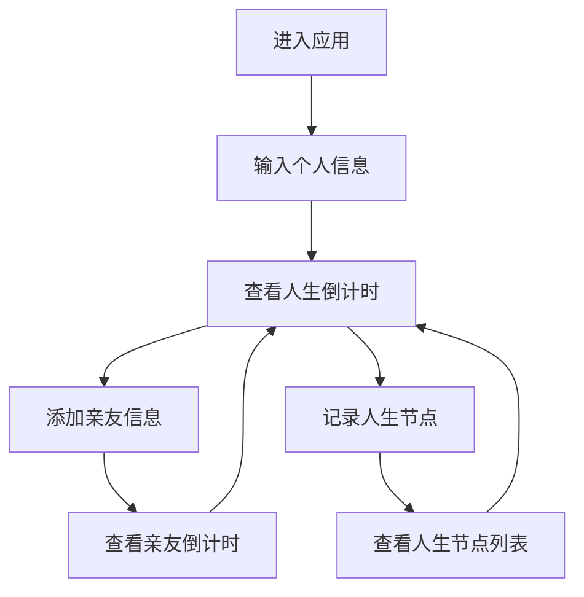

## 1. Product Overview
人生列车是一个体现人生哲学思想的网页应用，将人生比作一场列车旅途，帮助用户理解生命的意义和珍惜当下。
- 主要功能包括人生倒计时、亲友管理、关键节点记录，以及富有哲理的语句展示
- 目标用户为希望反思人生、珍惜当下的人群，具有积极的人生教育意义

## 2. Core Features

### 2.1 User Roles
| 角色 | 注册方式 | 核心权限 |
|------|----------|----------|
| 普通用户 | 无需注册 | 使用所有功能，数据存储在本地 |

### 2.2 Feature Module
1. **首页**：人生倒计时、列车主题界面、哲理语句展示
2. **亲友管理**：添加亲友信息、查看亲友倒计时
3. **人生节点**：记录和展示人生关键事件

### 2.3 Page Details
| 页面名称 | 模块名称 | 功能描述 |
|----------|----------|----------|
| 首页 | 人生倒计时 | 显示用户出生日期、预期寿命、剩余天数倒计时，突出显示在页面中央 |
| 首页 | 列车主题界面 | 设计体现列车元素，如车站、轨道、车厢等视觉元素 |
| 首页 | 哲理语句 | 根据场景动态展示经典、打动人的语句 |
| 亲友管理 | 亲友列表 | 显示已添加的亲友信息，包括姓名、出生日期、预期寿命、剩余天数 |
| 亲友管理 | 添加亲友 | 输入亲友姓名、出生日期、预期寿命等信息 |
| 人生节点 | 节点列表 | 显示用户添加的人生关键事件，包括日期、事件描述 |
| 人生节点 | 添加节点 | 输入事件日期、描述、重要程度等信息 |

## 3. Core Process
用户进入应用后，首先输入自己的出生日期和预期寿命，系统计算并显示人生倒计时。用户可以添加亲友信息，查看亲友的倒计时，也可以记录人生中的关键节点。系统会根据不同场景展示相应的哲理语句，帮助用户理解人生的意义。

## 4. User Interface Design
### 4.1 Design Style
- 主色调：深蓝色 (#1a365d) 和暖黄色 (#f6ad55)，象征列车行驶的天空和阳光
- 按钮风格：圆角设计，带有微妙的阴影效果
- 字体：主标题使用 serif 字体，正文使用 sans-serif 字体
- 布局风格：卡片式布局，带有列车轨道元素的装饰
- 图标风格：简约线条风格，使用火车、车站、时钟等相关图标

### 4.2 Page Design Overview
| 页面名称 | 模块名称 | UI元素 |
|----------|----------|--------|
| 首页 | 人生倒计时 | 大型数字显示，带有动态效果，背景为列车行驶的场景 |
| 首页 | 列车主题界面 | 顶部有列车轨道装饰，底部有车站元素，整体设计模拟列车内部 |
| 首页 | 哲理语句 | 优雅的文字排版，带有淡入淡出动画效果 |
| 亲友管理 | 亲友列表 | 卡片式列表，每个卡片显示亲友基本信息和倒计时 |
| 人生节点 | 节点列表 | 时间轴形式展示，带有车站图标标记 |

### 4.3 Responsiveness
- 设计采用桌面优先原则，同时支持移动端适配
- 在移动设备上，布局会自动调整为垂直排列
- 触摸设备优化，确保按钮和交互元素易于点击

### 4.4 3D Scene Guidance
- 考虑使用轻微的3D效果模拟列车行驶的场景
- 可以使用CSS 3D变换实现简单的深度感
- 动画效果模拟列车行驶的动态感