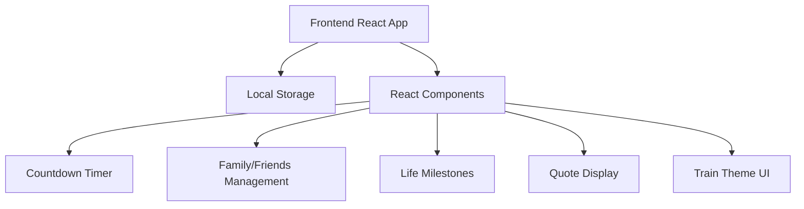
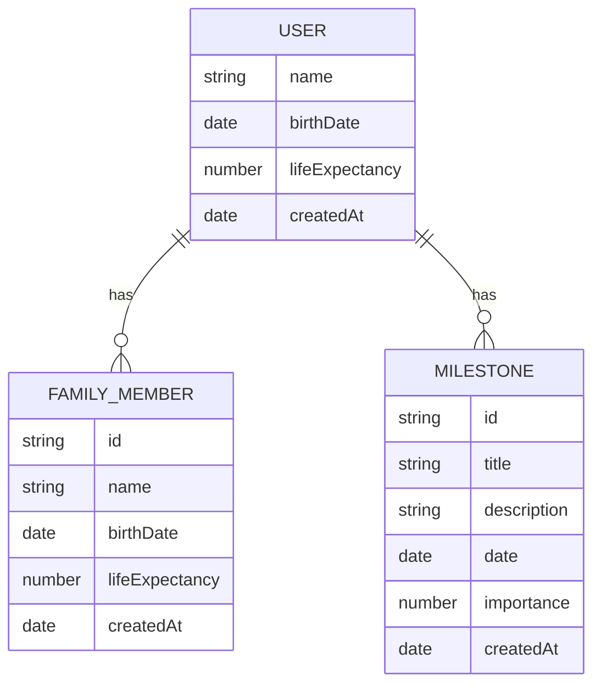

## 1. Architecture Design


## 2. Technology Description
- Frontend: React@18 + TypeScript + Tailwind CSS@3 + Vite
- Initialization Tool: Vite
- Backend: None (all data stored in local storage)
- Database: Local Storage (for persistence)
- State Management: Zustand
- UI Components: Custom components + Lucide icons

## 3. Route Definitions
| 路由 | 用途 |
|------|------|
| / | 首页，显示人生倒计时和哲理语句 |
| /family | 亲友管理页面 |
| /milestones | 人生节点页面 |

## 4. API Definitions
无后端API，所有数据操作通过本地存储实现。

## 5. Server Architecture Diagram
无后端服务器架构。

## 6. Data Model
### 6.1 Data Model Definition


### 6.2 Data Definition Language
使用本地存储存储数据，数据结构如下：

**User Data:**
```javascript
{
  "user": {
    "name": "用户名",
    "birthDate": "YYYY-MM-DD",
    "lifeExpectancy": 80,
    "createdAt": "YYYY-MM-DDTHH:mm:ss"
  }
}
```

**Family Members Data:**
```javascript
{
  "familyMembers": [
    {
      "id": "uuid",
      "name": "亲友姓名",
      "birthDate": "YYYY-MM-DD",
      "lifeExpectancy": 80,
      "createdAt": "YYYY-MM-DDTHH:mm:ss"
    }
  ]
}
```

**Milestones Data:**
```javascript
{
  "milestones": [
    {
      "id": "uuid",
      "title": "事件标题",
      "description": "事件描述",
      "date": "YYYY-MM-DD",
      "importance": 1-5,
      "createdAt": "YYYY-MM-DDTHH:mm:ss"
    }
  ]
}
```